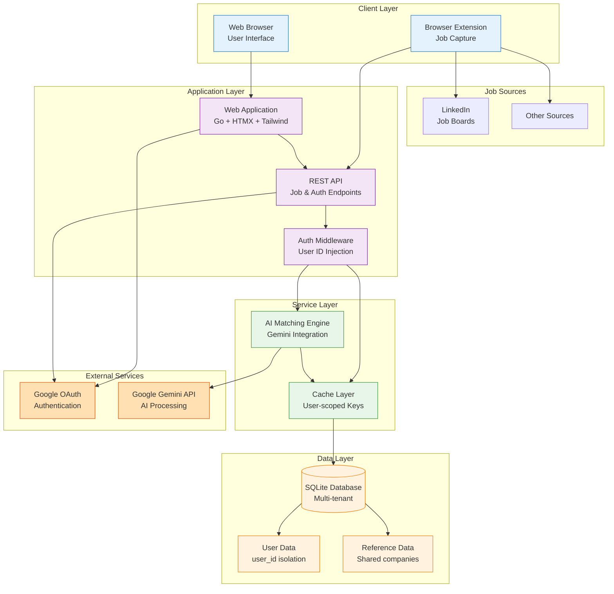

# Vega AI Architecture

## System Overview

Vega AI is a Go web application for AI-powered job search and application tracking, built with privacy and multi-tenancy in mind.



**Tech Stack:**

- **Backend:** Go with layered architecture
- **Database:** SQLite with WAL mode
- **Authentication:** JWT + Google OAuth
- **Frontend:** Go templates + HTMX + Tailwind CSS
- **AI:** Google Gemini API integration

## Architecture Patterns

### Request Flow

**Handlers → Services → Repositories → Database**

- **Handlers:** HTTP request/response, template rendering
- **Services:** Business logic, AI integration
- **Repositories:** Data access with interfaces
- **Database:** SQLite with transaction support

## Database Design

### Schema Overview

**Core Entities:**

- `users` - Authentication and user accounts
- `companies` - Shared reference data
- `jobs` - Job postings with user isolation
- `profiles` - User experience, education, skills
- `match_results` - AI analysis results

**Multi-Tenancy Design:**

- User-specific tables include `user_id` foreign key
- All queries filtered by `user_id` at repository level
- Companies table is shared reference data (by design)

### Relationships

- User → Profile (1:1)
- User → Jobs (1:many)
- Company → Jobs (1:many)
- Job → MatchResults (1:many)

## Security & Privacy

### Authentication

1. **OAuth Flow:**
   - Google OAuth primary authentication
   - No passwords stored in database
   - JWT tokens for session management

2. **Token Management:**
   - Access tokens (60 min default)
   - Refresh tokens (168 hours default)
   - Secure cookie storage

### Multi-Tenant Data Isolation

1. **Row-Level Security:**

   ```go
   // All queries automatically filtered
   WHERE user_id = ? AND id = ?
   ```

2. **Repository Pattern Enforcement:**
   - User ID required for all operations
   - Automatic injection via middleware
   - Compile-time safety through interfaces

3. **Cache Isolation:**
   - Cache keys prefixed with user ID
   - Pattern: `job:u{userID}:*`
   - Automatic invalidation on updates

### GDPR-Compliant Logging

#### Core Principles

1. **No Direct PII in Logs** - Never log personal data
2. **Use References** - Anonymous identifiers only
3. **Hash Identifiers** - One-way hashes for correlation
4. **Event-Based** - Log events, not data

#### What NOT to Log

- ❌ Email addresses
- ❌ Usernames or names
- ❌ IP addresses
- ❌ OAuth tokens
- ❌ Any direct identifiers

#### What to Log

- ✅ User references: `user_123`
- ✅ Hashed identifiers
- ✅ Event types: `login_success`
- ✅ Anonymous metrics

#### Privacy Utilities

```go
// Get privacy-aware logger
log := logger.GetPrivacyLogger("module")

// Log auth events safely
log.LogAuthEvent("login_success", userID, true)

// Hash identifiers
hashedID := logger.HashIdentifier(email)

// Redact sensitive data
redacted := logger.RedactEmail(email) // j***e@example.com
```

## API Design

### RESTful Endpoints

#### Jobs

```plaintext
POST   /api/jobs           # Create job
GET    /api/jobs           # List jobs (filtered by user)
GET    /api/jobs/{id}      # Get job details
PATCH  /api/jobs/{id}      # Update job
DELETE /api/jobs/{id}      # Delete job
```

#### Authentication

```plaintext
POST   /api/auth/login     # Username/password (if enabled)
POST   /api/auth/refresh   # Refresh token
POST   /api/auth/logout    # Logout
GET    /auth/google        # OAuth initiate
GET    /auth/google/callback # OAuth callback
```

#### System

```plaintext
GET    /health             # Health check
GET    /health/ready       # Readiness probe
```

## AI Integration

### Service Architecture

- **JobMatcherService:** Calculates job-profile compatibility
- **CoverLetterGeneratorService:** Personalized letters
- **LLM Interface:** Pluggable providers (Gemini)

### AI Flow

1. User profile analyzed
2. Job requirements extracted
3. Gemini API generates analysis
4. Results cached per user

## Configuration

### Environment Variables

```bash
# Core
TOKEN_SECRET=your-jwt-secret
GEMINI_API_KEY=your-gemini-key

# Database
DB_CONNECTION_STRING=/app/data/vega.db?_journal_mode=WAL

# OAuth (Cloud Mode)
GOOGLE_CLIENT_ID=your-client-id
GOOGLE_CLIENT_SECRET=your-client-secret

# Features
CLOUD_MODE=true           # Enable multi-tenant mode
```

## Testing Strategy

### Test Levels

1. **Unit Tests:** Mock dependencies
2. **Integration Tests:** Real database
3. **Privacy Tests:** GDPR compliance

### Running Tests

```bash
make test                  # All tests
go test ./internal/auth/...  # Package tests
go test -cover ./...       # Coverage
```

## Performance Considerations

### Database Optimization

- SQLite WAL mode for concurrency
- Composite indexes on (user_id, field)
- Query optimization in repositories

### Caching Strategy

- User-scoped cache keys
- Automatic invalidation
- Badger cache for performance

## Deployment Architecture

### Local Development

```bash
docker-compose up
```

### Production Single-User

```bash
docker run -p 8765:8765 -v ./data:/app/data vega
```

### Production Multi-Tenant

```bash
docker run -p 8765:8765 \
  -e CLOUD_MODE=true \
  -e GOOGLE_CLIENT_ID=xxx \
  ghcr.io/benidevo/vega-cloud:latest
```

## Code Organization Best Practices

1. **Domain Separation:** Each package owns its domain
2. **Interface Boundaries:** Repository interfaces in domain
3. **Dependency Injection:** Services receive dependencies
4. **Error Handling:** Wrapped errors with context
5. **Privacy First:** No PII in logs or errors
