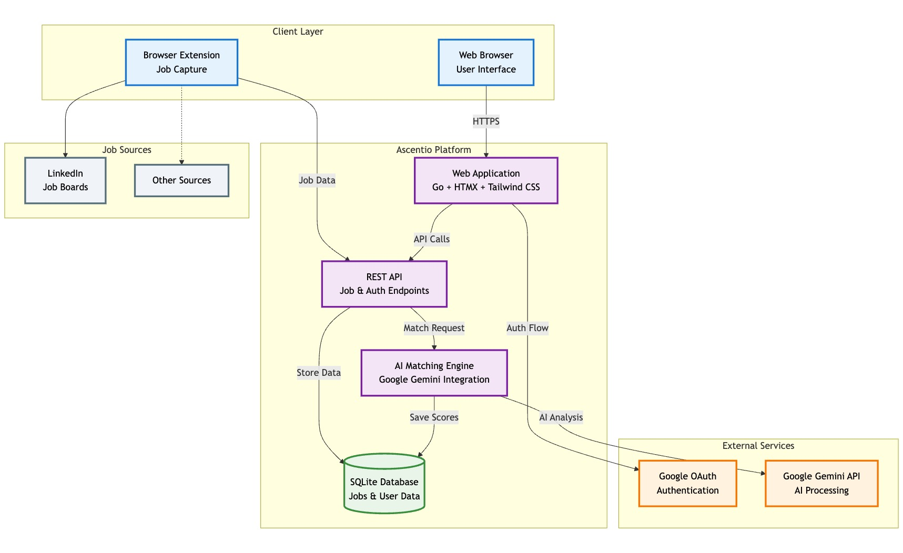

# Technical Design Document for Vega

## 1. System Architecture Overview

Vega uses a **monolithic architecture** implemented entirely in Go, with a SQLite database for persistence. The application is containerized using Docker and configured via environment variables and mounted files.

### 1.1 High-Level Architecture Diagram



### 1.2 Component Responsibilities

1. **Web UI & Admin Dashboard**
   * Responsive web interface built with Go templates
   * HTMX-powered interactive elements
   * Tailwind CSS for modern styling
   * Home page with authentication options

2. **Authentication System**
   * Google OAuth integration for user registration
   * Username/password authentication (legacy support)
   * Environment-based admin user creation
   * JWT token management for sessions

3. **Job Management**
   * Job CRUD operations via web UI and API
   * Job posting creation, editing, and deletion
   * Status tracking and filtering
   * Application status management

4. **Settings Management**
   * User preferences and configuration
   * Application settings storage
   * Environment-based configuration

5. **API Layer**
   * RESTful endpoints for job management
   * Authentication API endpoints
   * Health check and monitoring endpoints

6. **Database Layer**
   * SQLite for data persistence
   * Automated migration system
   * User, job, and settings data storage

## 2. Technology Stack

### 2.1 Core Technologies

* **Language**: Go 1.24+
* **Web Framework**: Gin
* **Database**: SQLite3 with WAL mode
* **Authentication**: Google OAuth 2.0, JWT tokens
* **UI Framework**:
  * Go templates with template inheritance
  * HTMX for interactive UI elements and form submissions
  * Tailwind CSS for responsive styling
  * Particles.js for background animations
  * Minimal JavaScript approach
* **Migration System**: golang-migrate for database schema management
* **Configuration**: Environment variables and file-based configuration

### 2.2 Development & Deployment

* **Containerization**: Docker
* **Orchestration**: Docker Compose
* **Configuration**: Environment variables + mounted files

## 3. API Endpoints

### 3.1 Job Management API

```plaintext
POST /api/jobs
- Add a new job posting
- Body: Job details (title, company, description, etc.)
- Returns: Created job with ID

GET /api/jobs
- Get list of jobs with optional filters
- Query params: status, search, page, limit
- Returns: Paginated job list

GET /api/jobs/{id}
- Get details for a specific job
- Returns: Complete job details

PATCH /api/jobs/{id}
- Update job details or status
- Body: Fields to update
- Returns: Updated job

DELETE /api/jobs/{id}
- Remove a job from the system
- Returns: Success confirmation
```

### 3.2 Authentication API

```plaintext
POST /api/auth/login
- Authenticate user with username/password
- Body: { username, password }
- Returns: Access and refresh tokens

POST /api/auth/refresh
- Refresh access token using refresh token
- Body: { refresh_token }
- Returns: New access token

POST /api/auth/logout
- Invalidate current session
- Returns: Success confirmation

GET /auth/google
- Initiate Google OAuth flow
- Redirects to Google authorization

GET /auth/google/callback
- Handle Google OAuth callback
- Returns: Authenticated session
```

### 3.3 Health & Monitoring API

```plaintext
GET /health
- Application health check
- Returns: System status and database connectivity

GET /health/ready
- Readiness probe for container orchestration
- Returns: Service readiness status
```

## 4. Configuration Architecture

### 4.1 Environment Variables

```plaintext
# Application Configuration
APP_NAME=vega
SERVER_PORT=:8080
IS_DEVELOPMENT=true
LOG_LEVEL=info

# Database Configuration
DB_DRIVER=sqlite
DB_CONNECTION_STRING=/app/data/vega.db?_journal_mode=WAL&_busy_timeout=5000&_foreign_keys=ON
MIGRATIONS_DIR=migrations/sqlite

# Authentication & Security
TOKEN_SECRET=your-super-secret-jwt-key-here
ACCESS_TOKEN_EXPIRY=60
REFRESH_TOKEN_EXPIRY=168
COOKIE_DOMAIN=
COOKIE_SECURE=false
COOKIE_SAME_SITE=lax

# Google OAuth Configuration
GOOGLE_CLIENT_ID=your-google-client-id
GOOGLE_CLIENT_SECRET=your-google-client-secret
GOOGLE_CLIENT_REDIRECT_URL=http://localhost:8000/auth/google/callback
GOOGLE_AUTH_USER_INFO_URL=https://www.googleapis.com/oauth2/v3/userinfo
GOOGLE_AUTH_USER_INFO_SCOPE=https://www.googleapis.com/auth/userinfo.email

# Admin User Creation (set CREATE_ADMIN_USER=true to create admin on startup)
CREATE_ADMIN_USER=false
ADMIN_USERNAME=admin
ADMIN_PASSWORD=change-this-secure-password
ADMIN_EMAIL=admin@example.com

# CORS Configuration
CORS_ALLOWED_ORIGINS=http://localhost:3000,http://localhost:8080
CORS_ALLOW_CREDENTIALS=true
```

### 4.2 Mounted Volumes & Files

```plaintext
/app/data/
  └── vega.db        # SQLite database file (with WAL journal)

/app/templates/
  ├── base.html          # Base template layout
  ├── home/              # Home page templates
  ├── auth/              # Authentication templates
  ├── jobs/              # Job management templates
  └── settings/          # Settings page templates

/app/static/
  ├── css/              # Compiled CSS assets
  ├── js/               # JavaScript files
  └── images/           # Static images and assets
```
